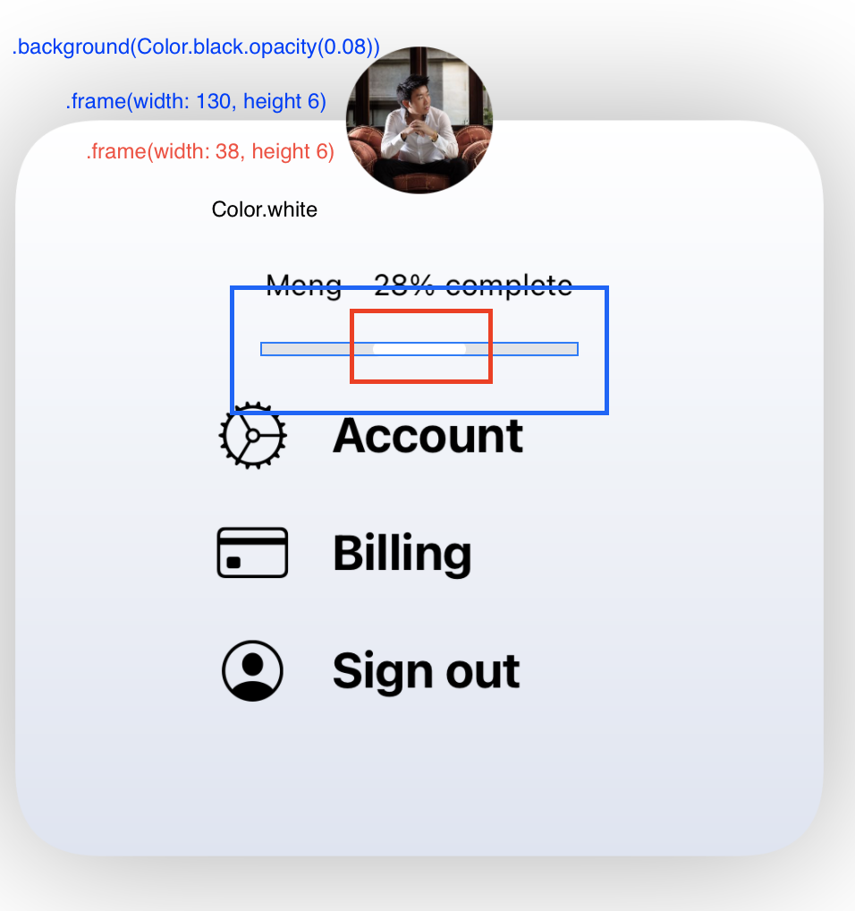
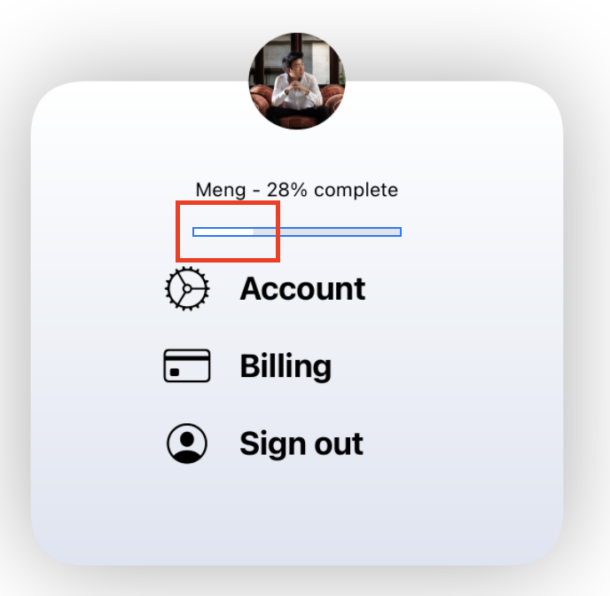
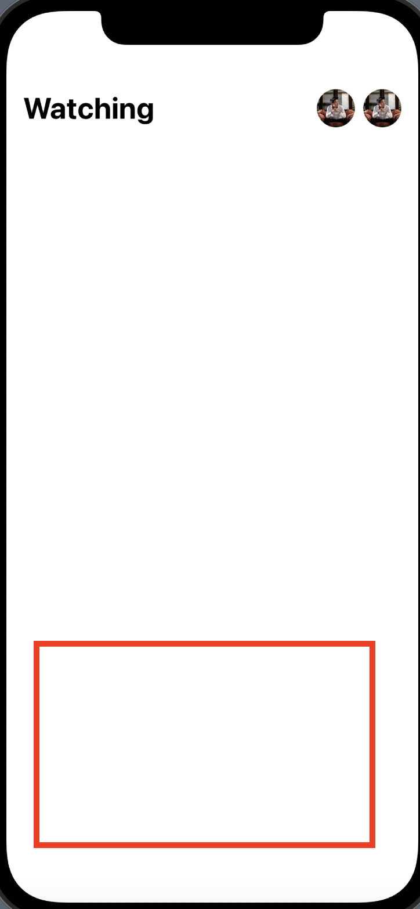

# DesignCodeStudy
디자인 코드 강의 보면서 실습, 메모하듯 기록, 모르는 개념 정리.  

## 목표
우선은 designcode.io의 Swift 강의를 듣고 정리하고 싶고
일단 Part1까지는 Readme에 정리 후 Part2를 시작할때는 각 코스마다 md파일을 따로 만들어 Readme 에 목록을 만들어 링크 타서 들어갈 수 있게 하기!

## Part 1
### 1 - Learn SwiftUI for iOS 13
- SwiftUI는 어떤 녀석인가? 전체적인 설명
- `@State & Animation` 상태만 정해준다면 SwiftUI가 두 상태 사이의 전환을 알아낼 것이다.
- `Stack` 에는  H, V, Z Stack이 있고, `spacing`, `alignment`를 이용하여 원하는 정렬로 배치할 수 있다.
- SwiftUI의 장점 iOS, macOS, watchOS, tvOS 모두에서 작동하기 때문에 같은 컴포넌트(구성요소)를 재사용할 수 있고, 코드 수정 또한 최소한으로 줄어든다.
- 선언적 코드 (Declaractive Code) 
- App Name 수정 `Project Setting` -> `Info` -> `Bundle Name`으로 접근해서 앱이름을 변경할 수 있다.   
```swift
// Live Preview
Group {
    ContentView()
    ContentView()
        .previewLayout(.sizeThatFits) // Preview 사이즈 조정
        .environment(\.sizeCategory, .extraExtraExtraLarge) // Accessibility << 이건 좀 더 알아보기
        .previewDevice("iPhone 8")  // Specific device 여러 디바이스 설정 가능 (기기이름, 기기이름)
}

// Dark Mode
.enviroment(.\colorScheme, .dark)
```   

<br>

💡`Spacer()`와 `.frame(minWidth: 0, maxWidth: .infinity)`를 이용하는 것의 각각의 차이 디테일은 뭘까?   

✅ 답해보기!   

<br>

💡os마다 사용할 수 있는게 다른건가? 공식문서들을 찾아보며 확인하기
```swift
// All
ZStack, VStack, HStack, TabView
NavigationView, Picker, Stepper, Slider, etc.
SF Symbols

// iPad / Mac
TabView

// Mac
Keyboard Shortcuts
```  

✅ 답해보기!   


<br>

---
### 2 - Layout and Stacks 
- Stack들을 이용하여 뷰 올리기 학습
- modifier 중에서도 clip(이미지를 자르는) 기능이 들어가있는 기능이 있다.
- `.cornerRadius`가 그예이다. `.shadow`를 적용하고 `.cornerRadius`를 적용하면 clip되기 때문에(경계값으로 프레임을 잡고 잘라버림) 그림자가 적용된것을 확인할 수 없다.
- SwiftUI는 선언적 언어이니 modifier 적용에도 순서에 주의하자.

<br>

---
### 3 - Components and Visual Effects 2
- View 재사용할 수 있게 Componemt로 나누는 작업 학습!!
- blur를 처음봐서 신기했음 (뷰를 흐리게 만들어주는 기능)
- padding `.padding([.leading, .vertical], 16)`와 같이 사용하면 중복 코드룰 줄일 수 있다.

<br>

---
### 4 - Animations and States
- State 어노테이션을 활용하여 Animation 적용
- 삼항연산자를 사용해서 true false 일 때 다른 값들을 넣어주어 화면을 표시하는게 재밌었음.

<br>

---
### 5 - Gestures and Events
`@State`를 적용하여 뷰, 제스쳐, 이벤트 등을 다루는 방법 학습

- `@State` annotation을 이용해  `viewState`라는 변수 선언
- `viewState` 기준으로 `offset` 설정한 `CardView`에  `.gesture()` `DragGesture`를 통해 제스쳐 했을때랑 제스쳐가 끝났을때 (`.onChanged`, `onEnded`) `viewState` 값을 변경시켜줘 효과 적용
- `.animation(.spring())`에서  `.spring()`을 커스텀하게 설정 해줘서 재미난 효과 적용
- 가장 신기한건 `offset` 2단적용.... `show` 상태에 따라 달리지기도 하고 `viewState`에 따라 달라지기도한다 (SwiftUI 너무 매력적)

<br>

---
### 6 - Timing Curve and Delay Animation
- State에 따라서 뷰의 offset이나 Animation을 다르게 적용해 주는데, View의 Componet를 잘 분리해주지 않으면 상태에 따른 뷰를 보여주는 코드를 적용하는데 힘들것으로 보인다.
- 선언적 언어의 장점을 잘 활용하기 위해서는 뷰를 잘 나눠줘야 할 것 같다.
- 한 뷰에 같은 modifier를 정해주더라도 상태에 따라서 다르게 적용가능, 즉 뷰가 상태에 따라 보이게 할 수 있다.   
```swift
.rotationEffect(.degrees(show ? 0 : 5))
.rotationEffect(Angle(degrees: showCard ? -5 : 0))
```   

<br>

---
### 7 - Dissmiss and Drag Anchors
- SF Symbol을 다운받아서 사용하였다.
- 새로운 화면을 만들기 위해 SwiftUI View 파일을 만들어 주었다.
- 이 뷰에서도 Component를 만들어 주었는데, 프로퍼티를 선언해줌으로써 각기 다른 타이틀과 아이콘으로 재사용해주었다.!

💡 SF Symbol을 다운 받기만 하면 import를 따로 하지 않아도 아이콘을 쓸 수 있는건가??   
✅  SF Symbol을 다운 받지 못하면 `gear` 같이 제공해주는 이미지를 쓸 수 없음.    

<br>

💡 맞다면 따로 import 하지 않고 배포를 해도 핸드폰에서 그 icon이 잘 보이는걸까??   
✅   

<br>

---
### 8 - SF Symbols and Props
MenuView 뷰 구현, Component 분리 
<br>

---
### 9 - Color Literal, Gradient and Overlay
Gradient를 사용해서 그라데이션 줄 수 있다.   
Color Literal 사용해서 색깔 적용. 일반적인 Style Guide에 의하면 Color Literal을 앞으로 사용하진 않을듯., 
`.overLay()`  덮어씌우다
- `ZStack` 방법 말고 뷰를 겹치는 방법 중 하나.    
<br>

`overlay(_:alignment:)`
- `ZStack`을 적용했을 때와 비슷한 효과를 내는 modifier이다.
- 적용한 뷰의 위에 뷰가 올려지게 되고, 특이점은 `.frame()` 따로 지정하지 않으면 적용한 뷰와 같은 크기를 가진다는 것이다.
- `background()`는 `overlay`와는 반대로 적용한 뷰의 하위에 뷰가 쌓인다.
- [overlay(_:alignment:)](https://developer.apple.com/documentation/swiftui/view/overlay(_:alignment:)) 는 15이전까지만 사용되고 deprecated 됨.
- [overlay(alignment:content:)](https://developer.apple.com/documentation/swiftui/view/overlay(alignment:content:)) 대체자로는 iOS 15 부터 사용가능한 이 메서드이다.   
<br>

`modifier 연속 적용`
아래의 코드를 처음 보았을 때 신기하기도 했지만 혼란스러웠다.   
```swift
Color.white
    .frame(width: 38, height: 6)
    .cornerRadius(3)
    .frame(width: 130, height: 6)
    .background(Color(#colorLiteral(red: 0, green: 0, blue: 0, alpha: 1)).opacity(0.08))
    .cornerRadius(3)
    
```    

<div align="center">
    
    
</div>

swiftUI의 특성을 아직 확실히 이해하진 못한 상황이지만 modifer의 대부분은 View 프로토콜을 따르는 content를 반환한다.      
정확히 말하자면 `cornerRadius`가 반환한 뷰에 `frame`을 지정해주는게 맞지만 좀 위의 코드와 별개로 간결하게 상황을 바라보자면 이미지 처럼 `.frame()`을 두번 적용했을 때를 확실하게 이해하고 싶었다.   
Color.white의 frame을 .frame() 메서드를 통해 잡아주었고, Color뷰의 크기를 값 만큼 변하여 반환해준걸로 보인다.   
- 여기서 새로운 `.frame(width: 130, height: 6)`처럼 .frame을 한번 더 적용해 줄 시 나는 `white`컬러의 뷰가 130만큼 늘어날 줄 알았지만, 너비가 38 사이즈의 뷰가 white 색으로 자리 잡고 있고, 그것과는 별개로 default 색이 뭔지는 모르겠지만 기대했던 하얀색이 아닌 너비 130을 가진 새로운 뷰가 생성되었다.   
<br>
💡 즉 `Color.white`가 아닌 Color.white에 `.frame 수정자를 적용해 리턴한 뷰`의 사이즈를 새로 선언한 `.frame(width: 130, height: 6)` 수정자를 통해 사이즈를 정해주었다고 이해하였다.    
글로 쓰면서도 정리가 잘 안되고 어려웠지만 내 생각의 정리에는 도움이 된 것 같다.   
이게 잘못된 이해일 수도 있지만 WWDC와 다른 문서들을 보며 나의 생각을 계속 점검해 나갈 생각이다.   

<br>

`.frame(width: 130, height: 6, alignment: .leading)`을 적용한 결과 너비 38의 뷰가 leading으로 정렬 되는 것으로 볼 때 `.frame(width: 130, height: 6, alignment: .leading)`로 수정해준 뷰가 너비 38의 뷰를 감싸고 있음을 알 수 있다.

<br>

---
### 10 - Animation Between Screens
`.renderingMode(.mode)`   
`template`   
- 이미지의 불투명 영역이  가진 본래의 색 무시하고 원하는 색으로 변경해 템플릿 이미지로 활용
`original`     
- 항상 이미지 본래의 색 유지   

<br>

`.resizable()`
- 이미지의 사이즈 frame을 조절하는데 `.resizable()`을 하지 않고 했더니 변화가 없었다.

<br>

`.edgesIgnoringSafeArea()`, `.ignoresSafeArea()`의 차이   
`.edgesIgnoringSafeArea()`   
- 일단 이건 14.5까지 밖에 지원이 안된다. `deprecated`됨 -> `.ignoresSafeArea()`  를 쓰라고 나와있음

`.ignoresSafeArea(regions: , edge:)`   
- iOS 14버전 이상 지원가능
- 엣지는 어느정도 예상가능
- regions에는 `.all`, `container`, `keyboard`가 있는데 각 의미가 뭘까?
- 내 이해로는 `.all` 은 모든 세이프 에어리어 무시, `container` <->  `.all`과의 차이는 모르겠다., `keyboard`는 키보드는 `container`   `.all` 와 차이가 있어 보이는데 정확하게 알아내지는 못했다.
- 애매한 이해가 되었는데 사용하면서 자세하게 알아보자

`.ignoresSafeArea(.all)`를 적용할 경우 세이프에어리어를 무시하기 때문에 `top`, `bottom` 기준으로 잡은 `.padding()`이 원하는 결과대로 보여지지 않는다.   

여러가지로 집중이 잘 되지 않던 날 .,.,화이팅    

<br>

---
### 11 - Drag Progress and Tap Background

```swift
// 툴무명도를 0으로 설정하면 상호작용을 하지 않고 0.001로 주면 상호작용을 한다
// 0으로 적용했을때는 처음에 백그라운드에 opacity가 적용되지 않아 뷰가 인식이 되지않아? 눌러도 반응이 없고
// 0.001 이라도 아주 작은값으로 설정하면 뷰가 인식되어? 상호작용을 한다 구체적인 이유는 모르겠지만 차이는 있다.
.background(Color.black.opacity(0.001))
```     
<div align="center">
    
</div>

<br>

```swift
// 이 코드에 녹아 버림
// 일단은 그려놓고 offset으로 안보이게 설정한다음에 
// CGSize라는 상태값을 바라보고
// 드래그 제스쳐를 통해 높이가 특정값 이하로 내려가면 상태를 바꾼다.!! 이거슨 대단..

.gesture(
    DragGesture().onChanged { value in
    self.viewState = value.translation
}
.onEnded { value in
    if self.viewState.height > 50 {
    self.showProfile = false
}
    self.viewState = .zero
}
)
```   

<br>

💡`SwiftUI`의 핵심은,. 선언적이기 때문에 뷰를 다 그려놓는다?   
💡 그리고 상태값에 따라 뷰를 보여준다 안보여준다 << .offset을 많이 활용하는것 같음.  
✅ 그렇다면 푸쉬나 프리젠트를 사용하지 않는걸까???
- 그건 아닌것 같다 화면 전환에 따라서 데이터가 일시적이라면 프리젠트, 연속된다면 푸쉬를 해주는건 일치해보인다.
- 하지만 화면을 새로 띄우거나 댑스가 깊어지는것과 같은 작업이 아니라면 하나의 화면에 모두 띄워놓고 숨겨놓냐 아니냐의 차이같다.   

<br>

---
### 12 - Binding and Screen Size
컴포넌트를 만들고 상태를 바인딩하는 방법에 대해 배운다.   
이전에는 많은 뷰들이 사용되고 있기 때문에 뷰 코드가 지저분해지고 있다.   
컴포넌트를 어떻게 만들고 컴포넌트간에 상태를 어떻게 공유하는가를 배울것이다.   

<br>

Binding이란?   
- 정의된 `@State` 변수를 사용하고 해당 값을 지켜보고 변경된 값을 넘겨받음, 변경이 일어날 경우 상태에 따라 뷰를 변경하여 그리기 위해 사용   
- 외부의 값에 연결되어 있다.   

<br>

컴포넌트 분리   
- 컴포넌트 분리 시 같은 파일일 경우 `@State` 변수를 사용해야 한다면 `@Binding` 변수를 선언해주고 `$`를 통해 넘겨줌으로써 해결가능하다.
- 그러나 다른 파일일 경우에는 위와 같이 적용 시 프리뷰 쪽에서 오류가 난다.
    - `.constant(<#T##value: Bool##Bool#>)`과 같은 디폴트 값을 설정해줘야 프리뷰를 랜더링 가능한것으로 보인다.
    
 `let screen = UIScreen.main.bounds`   
 - 위와 같이 스크린이라는 상수를 선언해 놓으면 `screen.height` 과 같은 값을 사용해서 화면마다 사이즈가 다른 뷰에 대한 대처가 가능.
 - offset 과 같은 기능을 사용할 때 유용할 것으로 보임

<br>

💡 @State 변수를 사용할 때 그냥 사용하는 것과 `$` 즉 바인딩으로 사용하는 것의 정확한 차이는 뭘까?  
✅  상위 뷰에서 `@State` 변수를 선언하고 사용시에는 그냥 사용해도 되지만 component로 분리된 하위 뷰에서는 정의된 `@State` 변수를 사용하기 위해서 `@Binding` 을 선언해주어야하고 상위 뷰에서 `$변수이름`으로 전달해주어 다른 부분에서  `@State` 변수의 값이 변경되도 감지 할 수 있다.    

<br>

### 13 - ScrollView and Repeat
ScrollView()에 대해 배웠다.      
강의를 좀 더 빨리봤더라면~ 아쉽지만 어쩔수 없고~   

<br>

`ScrollView`   
- 스크롤 뷰의  목적은 스크롤할 수 있는 프레임을 설정하는 것이며, 콘텐츠는 레이아웃을 결정한다. 
- 스크롤 뷰는 스크롤 기능 제공과 프레임설정하는 것일뿐 나머지 많은 부분들은 콘텐츠를 어떻게 작성해주냐에 달렸다.  
- `init(_ axes: Axis.Set = .vertical, showsIndicators: Bool = true, content: () -> Content)`   
- axes:  스크롤이 가능한 축 (default는 .vertical)
- showsIndicators: 스크롤 시 인디케이터 표시 여부 (default = true)
- content: 보여줄 컨텐츠   
- 스크롤뷰 사용시 default 값을 사용할 경우에는 값을 넣어주지 않는 편이 나을것 같다.
- horizontal 방향 스크롤 뷰를 쓰는 경우 반복되는 뷰를 HStack 넣어주어 원하는 화면을 만들 수 있었다.   

<br>

---

### 14 - Data and Image Literal
스크롤뷰의 각 뷰에 다른 데이터들과 이미지 적용을 해보즈아   
- image, color Literal 쓰는게 좋다고 설명해주는거 같은데 스타일 가이드나, 클린 코드를 봐서 이기도 하고, 별로 끌리는 방법은 아니다.   

<br>

우선 화면에 필요한 값들을 담을 적당한 타입을 만들어 준다.   
같은 구조의 뷰들이 각각의 데이터에 맞게 표현되려면 화면에 표시할 값들을 가지고 있는 타입의 배열이 필요하다.   
예제에서는 배열을 선언해주었지만, 실제로는 서버를 통해 데이터들을 받아오게 될것이다.   
`ForEach`를 이용해서 뷰를 그려주는데 아주 쉽고 간단하다.   
```swift
// 뚝딱

ForEach(sectionData) { item in
    SectionView(section: item)
}
```   

💡 주의할 점이있다면 타입 생성시에 `Identifiable`를 채택해야 한다는 점이다.   
- 이유는 배열에 담더라도 그 타입이 유니크하다는걸 증명해야 한다?일까
- 정확한건 알아보기   

<br>

😆 캬캬 오늘 배운 영어는 `voila` 짜쟌이다 ㅋㅋㅋㅋ.   

<br>

---

### 15 - 3D Scroll Animation
`Geometry Reader`에 대해 배우게 될 듯.
`Geometry Reader`를 사용해주면 부모뷰의 크기에 비례해서 사이즈를 지정할 수 있는데, 실제 적용에서 원하는데로 적용이 안되서 헤맸던 기억이 있다.   

<br>

`Geometry Reader`를 `HStack`, `VStack`의 안쪽에 넣어서 사용했을 때는 잘 적용이 안됬는데, 밖으로 빼서 적용했을 때는. 원하는대로 사이즈가 지정되었다.   
결국 해결을 하긴 했지만, 약간의 팁을 얻은것 같고 이슈가 생겼던 정확한 이유에 대해 알아내지 못했다.   
이번 강의를 들으면서 좀 더 깊게 생각해보자,.   
내일의 나 화이팅💪. 굳굳 잘하고 있는즁    

<br>

흠 내가 생각한 것 보단 geometry에 대한 내용을 깊게 다루진 않았고 제목 그대로 3D Scroll Animation에 대한 내용이 전부였다.   
당장 애니메이션 코드를 정확히 이해하고 어떻게 동작하는지를 세부적으로 들여다 보기엔 다른 내용들이 더 중요하게 느껴져 다른 강의들에 비해 집중이 잘 안되었다.    
그랬다면 보상(세뇌)으로 1강 더 출발.!   

<br>

---
